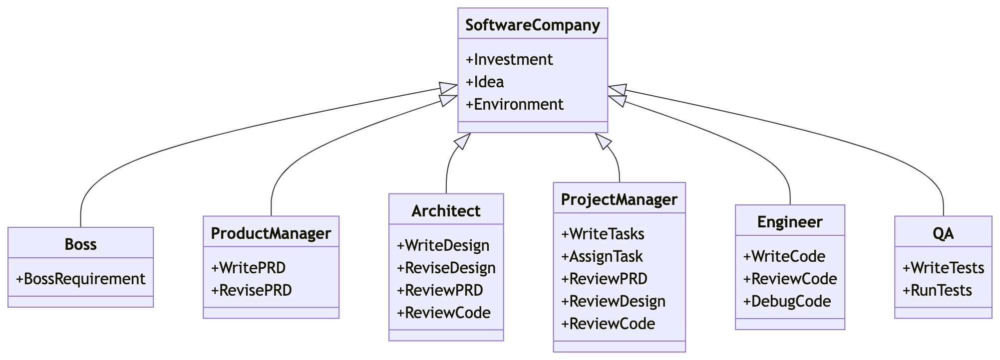

# MetaGPT: 多智能体框架

<p align="center">
<a href=""></a>
</p>

<p align="center">
<b>使 GPTs 组成软件公司，协作处理更复杂的任务</b>
</p>

<p align="center">
<a href="docs/README_CN.md"></a>
<a href="README.md"></a>
<a href="docs/README_JA.md"></a>
<a href="https://discord.gg/DYn29wFk9z"></a>
<a href="https://opensource.org/licenses/MIT"></a>
<a href="docs/ROADMAP.md"></a>
<a href="https://twitter.com/MetaGPT_"></a>
</p>

<p align="center">
   <a href="https://vscode.dev/redirect?url=vscode://ms-vscode-remote.remote-containers/cloneInVolume?url=https://github.com/geekan/MetaGPT"></a>
   <a href="https://codespaces.new/geekan/MetaGPT"></a>
   <a href="https://huggingface.co/spaces/deepwisdom/MetaGPT-SoftwareCompany" target="_blank"></a>
</p>

1. MetaGPT输入**一句话的老板需求**，输出**用户故事 / 竞品分析 / 需求 / 数据结构 / APIs / 文件等**
2. MetaGPT内部包括**产品经理 / 架构师 / 项目经理 / 工程师**，它提供了一个**软件公司**的全过程与精心调配的SOP
   1. `Code = SOP(Team)` 是核心哲学。我们将SOP具象化，并且用于LLM构成的团队



<p align="center">软件公司多角色示意图（正在逐步实现）</p>

## 安装
### Pip安装

> 确保您的系统已安装 Python 3.9 或更高版本。您可以使用以下命令来检查：`python --version`。  
> 您可以这样使用 conda：`conda create -n metagpt python=3.9 && conda activate metagpt`

```bash
pip install metagpt
metagpt --init-config  # 创建 ~/.metagpt/config2.yaml，根据您的需求修改它
metagpt "创建一个 2048 游戏"  # 这将在 ./workspace 创建一个仓库
```

或者您可以将其作为库使用

```python
from metagpt.software_company import generate_repo, ProjectRepo
repo: ProjectRepo = generate_repo("创建一个 2048 游戏")  # 或 ProjectRepo("<路径>")
print(repo)  # 它将打印出仓库结构及其文件
```

详细的安装请参考 [cli_install](https://docs.deepwisdom.ai/guide/get_started/installation.html#install-stable-version)

### Docker安装
> 注意：在Windows中，你需要将 "/opt/metagpt" 替换为Docker具有创建权限的目录，比如"D:\Users\x\metagpt"

```bash
# 步骤1: 下载metagpt官方镜像并准备好config2.yaml
docker pull metagpt/metagpt:latest
mkdir -p /opt/metagpt/{config,workspace}
docker run --rm metagpt/metagpt:latest cat /app/metagpt/config/config2.yaml > /opt/metagpt/config/config2.yaml
vim /opt/metagpt/config/config2.yaml # 修改配置文件

# 步骤2: 使用容器运行metagpt演示
docker run --rm \
    --privileged \
    -v /opt/metagpt/config/config2.yaml:/app/metagpt/config/config2.yaml \
    -v /opt/metagpt/workspace:/app/metagpt/workspace \
    metagpt/metagpt:latest \
    metagpt "Write a cli snake game"
```

详细的安装请参考 [docker_install](https://docs.deepwisdom.ai/main/zh/guide/get_started/installation.html#%E4%BD%BF%E7%94%A8docker%E5%AE%89%E8%A3%85)

### 快速开始的演示视频
- 在 [MetaGPT Huggingface Space](https://huggingface.co/spaces/deepwisdom/MetaGPT-SoftwareCompany) 上进行体验
- [Matthew Berman: How To Install MetaGPT - Build A Startup With One Prompt!!](https://youtu.be/uT75J_KG_aY)
- [官方演示视频](https://github.com/geekan/MetaGPT/assets/2707039/5e8c1062-8c35-440f-bb20-2b0320f8d27d)

https://github.com/geekan/MetaGPT/assets/34952977/34345016-5d13-489d-b9f9-b82ace413419

## 教程
- 🗒 [在线文档](https://docs.deepwisdom.ai/main/zh/)
- 💻 [如何使用](https://docs.deepwisdom.ai/main/zh/guide/get_started/quickstart.html)  
- 🔎 [MetaGPT的能力及应用场景](https://docs.deepwisdom.ai/main/zh/guide/get_started/introduction.html)
- 🛠 如何构建你自己的智能体？
  - [MetaGPT的使用和开发教程 | 智能体入门](https://docs.deepwisdom.ai/main/zh/guide/tutorials/agent_101.html)
  - [MetaGPT的使用和开发教程 | 多智能体入门](https://docs.deepwisdom.ai/main/zh/guide/tutorials/multi_agent_101.html)
- 🧑‍💻 贡献
  - [开发路线图](ROADMAP.md)
- 🔖 示例
  - [辩论](https://docs.deepwisdom.ai/main/zh/guide/use_cases/multi_agent/debate.html)
  - [调研员](https://docs.deepwisdom.ai/main/zh/guide/use_cases/agent/researcher.html)
  - [票据助手](https://docs.deepwisdom.ai/main/zh/guide/use_cases/agent/receipt_assistant.html)
- ❓ [常见问题解答](https://docs.deepwisdom.ai/main/zh/guide/faq.html)

## 支持

### 加入我们

📢 加入我们的[Discord频道](https://discord.gg/ZRHeExS6xv)！

期待在那里与您相见！🎉

### 联系信息

如果您对这个项目有任何问题或反馈，欢迎联系我们。我们非常欢迎您的建议！

- **邮箱：** alexanderwu@deepwisdom.ai
- **GitHub 问题：** 对于更技术性的问题，您也可以在我们的 [GitHub 仓库](https://github.com/geekan/metagpt/issues) 中创建一个新的问题。

我们会在2-3个工作日内回复所有问题。

## 引用

如果您在研究论文中使用 MetaGPT 或 Data Interpreter，请引用我们的工作：

```bibtex
@inproceedings{hong2024metagpt,
      title={Meta{GPT}: Meta Programming for A Multi-Agent Collaborative Framework},
      author={Sirui Hong and Mingchen Zhuge and Jonathan Chen and Xiawu Zheng and Yuheng Cheng and Jinlin Wang and Ceyao Zhang and Zili Wang and Steven Ka Shing Yau and Zijuan Lin and Liyang Zhou and Chenyu Ran and Lingfeng Xiao and Chenglin Wu and J{\"u}rgen Schmidhuber},
      booktitle={The Twelfth International Conference on Learning Representations},
      year={2024},
      url={https://openreview.net/forum?id=VtmBAGCN7o}
}
@misc{hong2024data,
      title={Data Interpreter: An LLM Agent For Data Science}, 
      author={Sirui Hong and Yizhang Lin and Bang Liu and Bangbang Liu and Binhao Wu and Danyang Li and Jiaqi Chen and Jiayi Zhang and Jinlin Wang and Li Zhang and Lingyao Zhang and Min Yang and Mingchen Zhuge and Taicheng Guo and Tuo Zhou and Wei Tao and Wenyi Wang and Xiangru Tang and Xiangtao Lu and Xiawu Zheng and Xinbing Liang and Yaying Fei and Yuheng Cheng and Zongze Xu and Chenglin Wu},
      year={2024},
      eprint={2402.18679},
      archivePrefix={arXiv},
      primaryClass={cs.AI}
}
```
